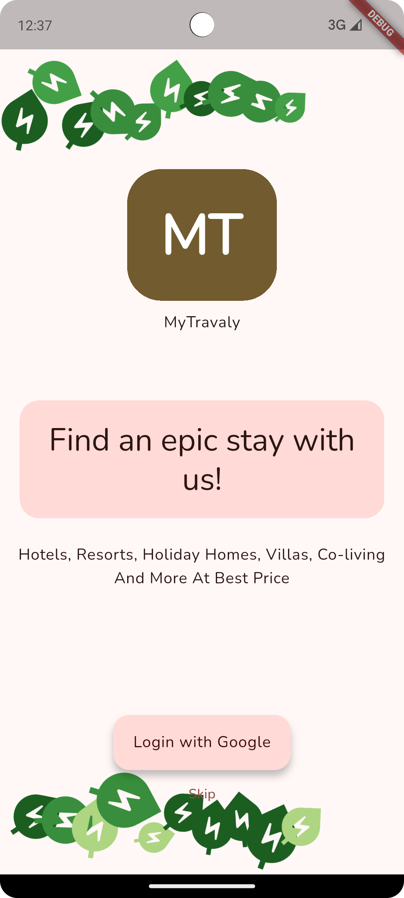
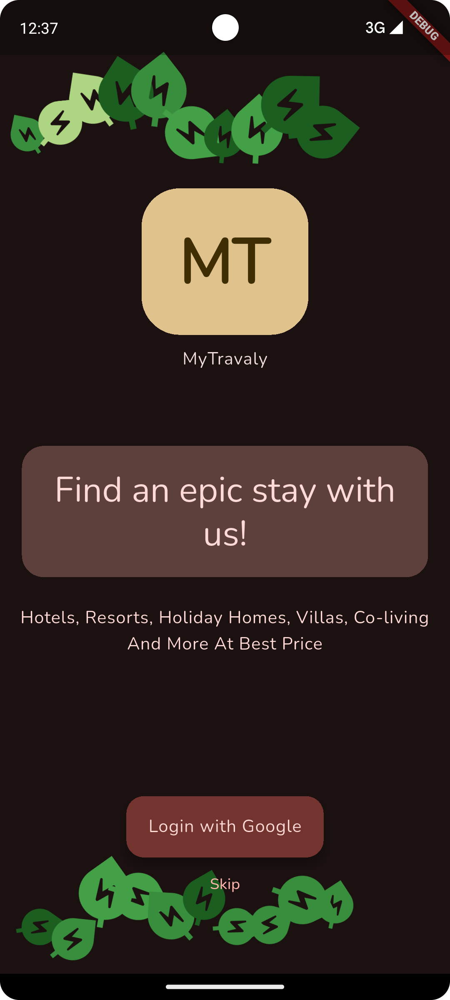

# Screening Task

# MyTravaly

## Environment Used

Flutter 3.35.1 • channel stable
Dart 3.9.0 • DevTools 2.48.0

## State Management Solution Used

BLoC

## Supports Dark and Light Theme

<table>
  <tr>
    <td>
      
       
      
<b>Light Mode</b>

    </td>

    <td>
      
       
      
<b>Dark Mode</b>

    </td>

  </tr>
</table>

## Three pages

- Auth -> Authentication using Google
- Home -> Showing a list of random hotels
- Search -> Showing autocomplete suggestions and showing list of hotels based on entered search
  criteria, in a paginated manner